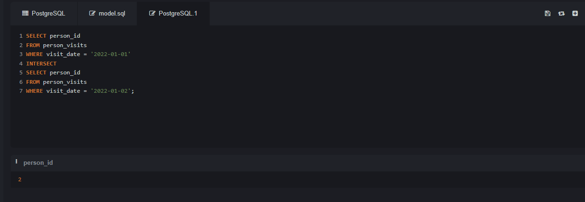
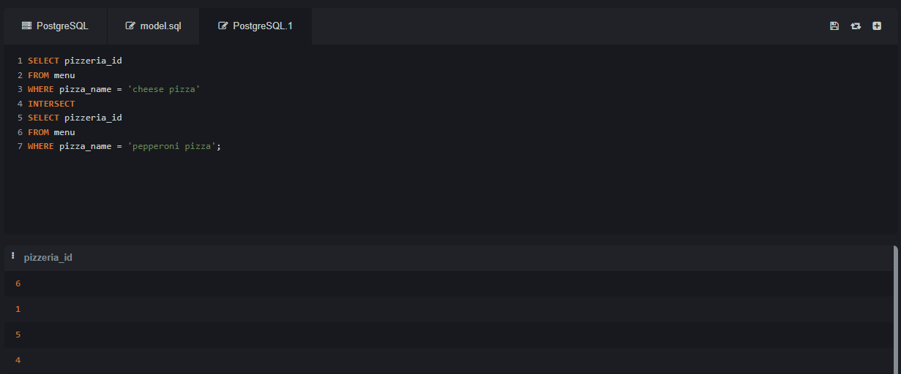
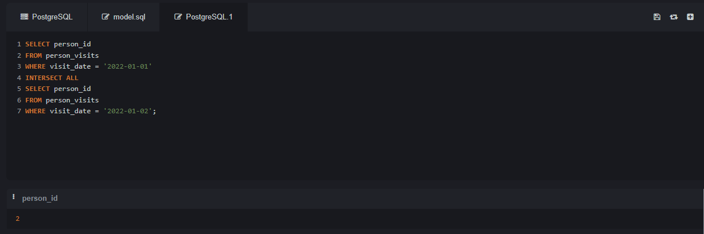
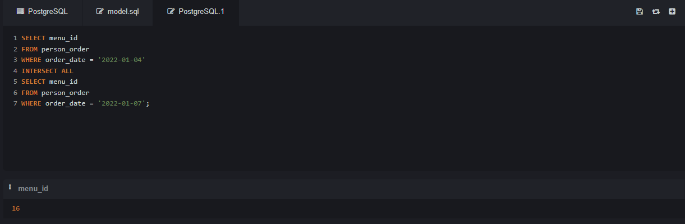
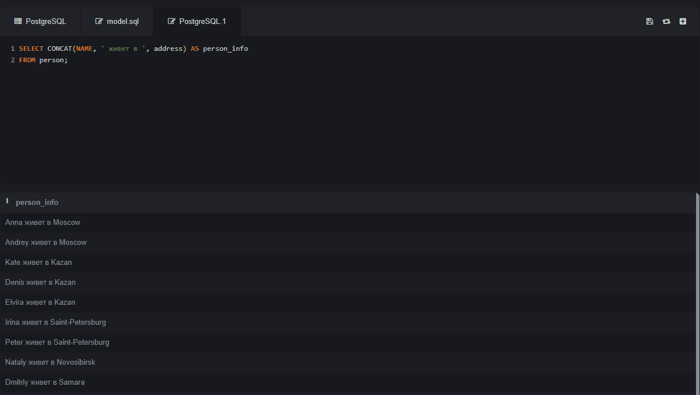
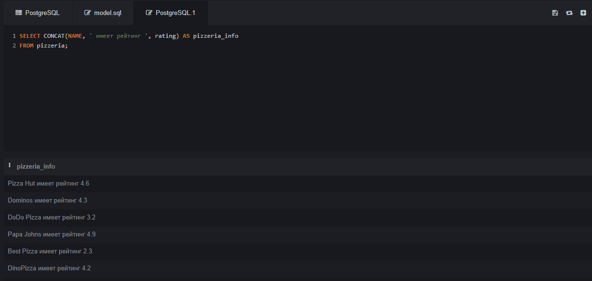
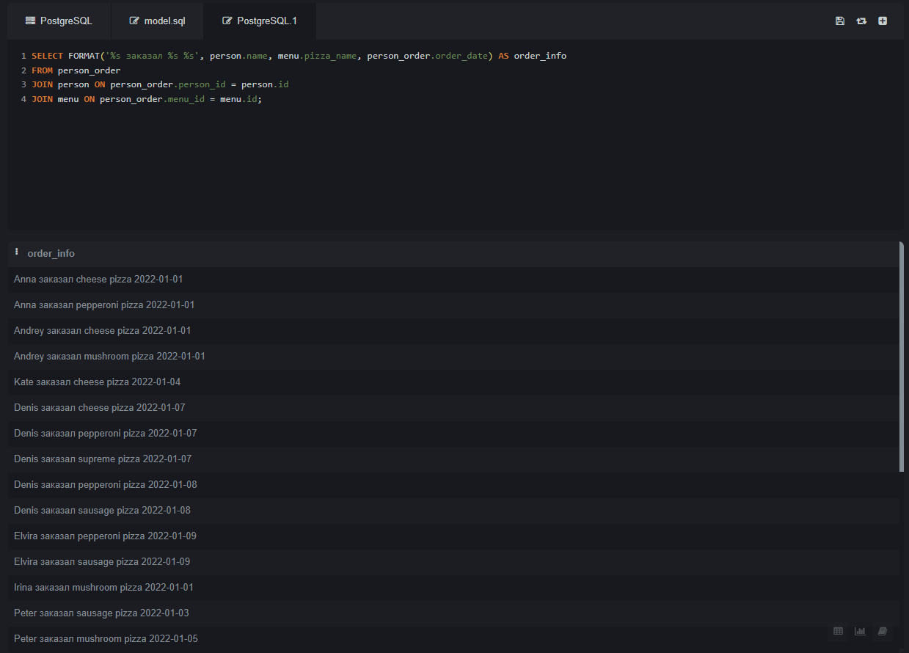
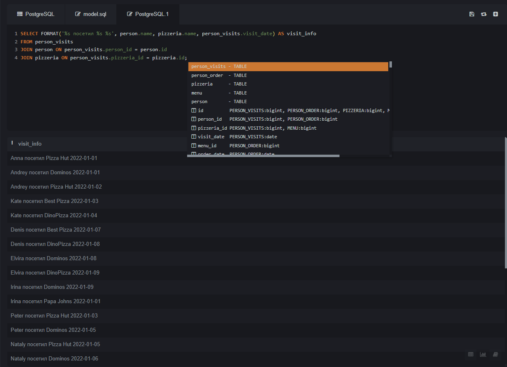

## 1. INTERSECT
- Функция INTERSECT используется для нахождения пересечения двух наборов данных. Она возвращает только те строки, которые присутствуют в обоих наборах данных. Например, если у нас есть два списка, функция INTERSECT вернет только те элементы, которые находятся в обоих списках.
### Запрос 1
Этот запрос находит общих людей, которые посетили пиццерии в две разные даты.
```sql
SELECT person_id
FROM person_visits
WHERE visit_date = '2022-01-01'
INTERSECT
SELECT person_id
FROM person_visits
WHERE visit_date = '2022-01-02';
```

### Пояснение
Запрос возвращает идентификаторы людей (person_id), которые посещали пиццерии как 1 января 2022 года, так и 2 января 2022 года.

### Запрос 2
Этот запрос находит пиццерии, которые имеют в меню как "cheese pizza", так и "pepperoni pizza".
```sql
SELECT pizzeria_id
FROM menu
WHERE pizza_name = 'cheese pizza'
INTERSECT
SELECT pizzeria_id
FROM menu
WHERE pizza_name = 'pepperoni pizza';
```

### Пояснение
Запрос возвращает идентификаторы пиццерий (pizzeria_id), в меню которых есть как "cheese pizza", так и "pepperoni pizza".

## 2. INTERSECT ALL
- Функция INTERSECT ALL аналогична функции INTERSECT, но она также включает дубликаты. Если элемент присутствует несколько раз в обоих наборах данных, он будет включен в результат столько раз, сколько раз он встречается в каждом наборе. Примечание: не все базы данных поддерживают INTERSECT ALL.

### Запрос 1
```sql
SELECT person_id
FROM person_visits
WHERE visit_date = '2022-01-01'
INTERSECT ALL
SELECT person_id
FROM person_visits
WHERE visit_date = '2022-01-02';
```

### Пояснение
Запрос возвращает идентификаторы людей (person_id), которые посещали пиццерии как 1 января 2022 года, так и 2 января 2022 года, включая дубликаты.

### Запрос 2
```sql
SELECT menu_id
FROM person_order
WHERE order_date = '2022-01-04'
INTERSECT ALL
SELECT menu_id
FROM person_order
WHERE order_date = '2022-01-07';
```

### Пояснение
Запрос возвращает идентификаторы заказов (menu_id), сделанных как 4 января 2022 года, так и 7 января 2022 года, включая дубликаты.

## 3. CONCAT
- Функция CONCAT используется для объединения двух или более строк в одну строку. Это полезно, когда необходимо создать строку из нескольких полей или значений.
### Запрос 1
```sql
SELECT CONCAT(name, ' живет в ', address) AS person_info
FROM person;
```

### Пояснение
Запрос возвращает строку, состоящую из имени человека, текста "живет в" и его адреса.

### Запрос 2
```sql
SELECT CONCAT(name, ' имеет рейтинг ', rating) AS pizzeria_info
FROM pizzeria;
```

### Пояснение
Запрос возвращает строку, состоящую из названия пиццерии и текста "имеет рейтинг", за которым следует числовое значение рейтинга.

## 4. FORMAT
- Функция FORMAT используется для форматирования строк с использованием заданного шаблона. Она позволяет вставлять значения в строку в определенных местах, что делает ее очень полезной для создания читаемых сообщений или отчетов.
### Запрос 1
```sql
SELECT FORMAT('%s заказал %s %s', person.name, menu.pizza_name, person_order.order_date) AS order_info
FROM person_order
JOIN person ON person_order.person_id = person.id
JOIN menu ON person_order.menu_id = menu.id;
```

### Пояснение
Запрос возвращает отформатированную строку с именем человека, названием пиццы и датой заказа.

### Запрос 2
```sql
SELECT FORMAT('%s посетил %s %s', person.name, pizzeria.name, person_visits.visit_date) AS visit_info
FROM person_visits
JOIN person ON person_visits.person_id = person.id
JOIN pizzeria ON person_visits.pizzeria_id = pizzeria.id;
```

### Пояснение
Запрос возвращает отформатированную строку с именем человека, названием пиццерии и датой посещения.